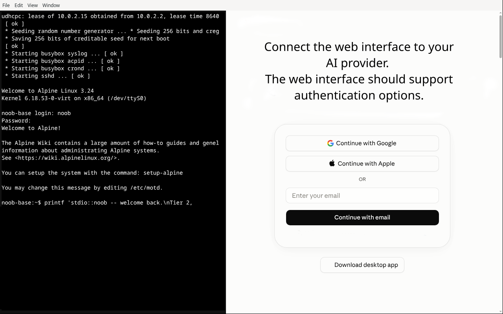
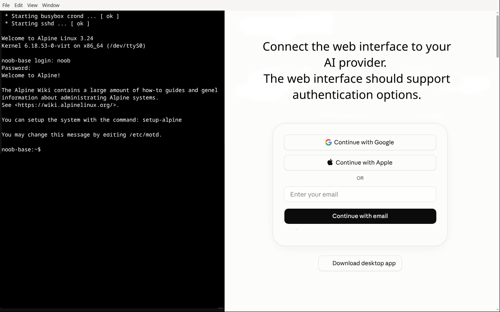

# stdio::noob

I started this project as a flashback to a friend who

bootstrapped my Macintosh Performa 6300 from nothing but a bare text

editor. This was an era where the internet was either BBS, Usenet,

Gopher or rather experimental and expensive by the minute besides.

We had Usenet, newsgroups, which was fantastic and still missed by me

and the library. We'd bootstrapped a 386 before that. This was

another beast: PowerPC with its own FPU architecture.

It was time to rerun that experiment. This time as a modern

"teach me how" variant, with everything we could only dream of back

then: fast internet, GitHub, Stack Overflow, forums, AI tools, all of

it we have today.

Please enjoy your journey. Take your time. The goal is learning

Understanding, rather than reaching a final build. Do as I do and

be happy to be a noob again as you progress through your

own journey.

That's also the reason this exists: "learn to code" is

everywhere and "learn whats actually happening underneath the code"

is nowhere. Every beginner resource starts you at

`print("hello world")`. Keeps you as far from the metal as it

possibly can. I wanted the opposite: start a learner at a 229-byte

seed and let them build their way up by hand through an

assembler, a C compiler and a full GNU toolchain they compiled

themselves until "container," "compiler," and "self-hosting" stop

being words they've heard and start being things they've personally

built and watched work.

The name is `stdio` (stdin/stdout nothing plus `noob` not a

complete beginner, someone whos noob *at going below the surface*.

If you've written code but never wondered what your compiler is

actually doing to it this is for you.

## What it actually is

A terminal-based editor and shell paired with an AI tutor

that can read your work but never write to it. The tutor gives you at

one line per turn. One command, one explanation when

you push it for more. Everything you build you type yourself. The

curriculum is a sequence: a chroot jail, real Linux namespaces

and cgroups a hand-assembled bootstrap compiler chain from a 229-byte

seed all the way to a self-hosting GCC 14 toolchain and then as far

past that as you want to go.

Every single step in that curriculum is something I actually

ran on real hardware and checked against a real result, a

checksum, a byte-for-byte comparison against a trusted build a real

programs real exit code. Nothing in here is "should work."

## Screenshots

A launch: the left pane is a real Alpine guest, booted and

logged in showing the real status line a learner sees on their way

back in. The right pane is the tutor pane, not a mockup.



The terminal is a pty into a real guest, not a transcript.

Whatever a learner types runs for real.



## Example start

The app is an Electron shell: a real terminal pane on the left an AI

tutor pane on the right both talking to the same real VM. Dev mode,

running locally:

```sh

cd app/electron

npm install

npm start

```

With no configuration that drops you into a local shell for

iterating on the app itself. To actually run the curriculum against a

real guest VM instead:

```sh

NOOB_VM_DISK=/path/to/your.qcow2 \

NOOB_VM_USER=noob \

NOOB_VM_PASSWORD=yourpassword \

NOOB_INJECT_PROMPT=1 \

npm start

```

That boots the guest logs in and injects the tutors own

curriculum prompt into the chat pane, the same real path a learners

own first session takes. See `Manual.md` for the full walkthrough

(building the guest image setting up the tutors own AI provider

login and what the first session actually looks like) and

`Bootstrap.md` for the real story of building the curriculum content

itself. What I tried, what. What I'm honest, about not

being sure of yet.
